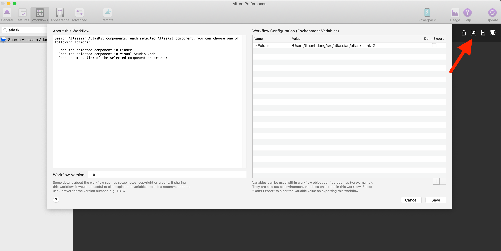

## Features

Search [Atlaskit packages](https://atlaskit.atlassian.com/packages) in a specified local folder.

## Installation

[import-workflow-source-to-alfred.md](https://github.com/tung-dang/alfred-workflow-nodejs-next/blob/master/docs/import-workflow-source-to-alfred.md)

### Commands
- TODO

## Development
- TODO

### Config:

- Set your local atlaskit git retro path to `akFodler` config like this:
