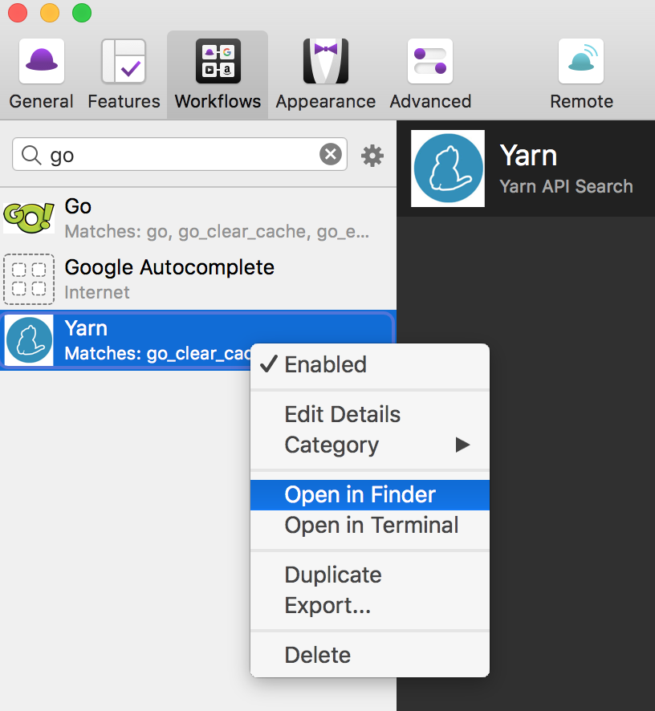

## Introduction

This document is to guide how to import AfWorkflow source code into Alfred.

## Setup

Open terminal at source code of a workflow

1. Install `nvm` - node version manager in (https://github.com/creationix/nvm)
2. Enter `nvm install` to download node version which is defined in `.nvmrc` (current node version is 7.2)
3. Enter `yarn install` to download all node packages dependencies.
4. Import workflow into Alfred tool by one of following ways:
    1. Double-click on exported file in `exported-worfllow-file/xxx.alfredworkflow`
    2. Or copy/create a symbolic link of workflow source code folder into Alfred custom workflow store folder,
ex: `/Users/<your-user-name>/Dropbox/app_backup/Alfred.alfredpreferences/workflows`
You can find full path of Alfred custom workflow store folder by right-click on any existing workflow item in Alfred Workflow tab --> choose Open in Finder --> Go up one level.

