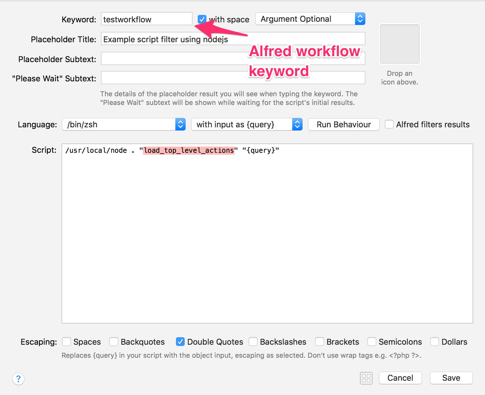

## Workflow skeleton

In Alfred Workflow tab UI, create a `Input -> Script Filter` item and insert a bash command to start your app.
The bash command has 2 input: `action_name` and `query`:




```shell
# Must use full path of `node`. I don't know how to use `node` global in Alfred Script Filter yet.
# Please suggest me if you have a better solution
/usr/local/bin/node main.js "action_name" "query"
```

**main.js**
```js
const { AfWorkflow, AfItem } = require('alfred-workflow-nodejs-next');

(function initMyWorkflow() {
    const workflow = new AfWorkflow();
    workflow.setName('example-alfred-workflow-using-nodejs');

    actionHandler.onAction('action_name_1', (query) => {
        // your code to handle action 1 here
    });

    actionHandler.onAction('action_name_2', (query) => {
        // your code to handle action 2 here
    });

    actionHandler.onSubActionSelected('action_name_2', (query, previousSelectedTitle, previousSelectedArg) => {
        // your code to handle selected sub action item of action_name_2 here
    });

    AlfredNode.start();
})();
```

## A Workflow example scenario:

- Open Alfred and type workflow shortcut, ex: `testworkflow`
    + => Alfred shows 2 top level feedbacks/actions in UI: `Feedback A` and `Feeback B`
    + => use arrow key to navigate to `Feedback B` row and press `TAB` or `ENTER` to choose that action.
    + => Alfred search bar will now become `Feedback B ➤ `
    + => and display sub action items of `Feedback B`: `Item 1 of Feedback B` and `Item 2 of Feedback B`
    + => Execute a sub action item by using `TAB` or `ENTER` key

- I tested with 2 action levels. I have not tested more than 2 action levels.

Here are some steps to implement above example scenario:

### Register listener for Workflow shortcut name `testworkflow`

- The action name `load_top_level_actions` will generate 2 top level items: `Feedback A` and `Feeback B`
- Top level action usually has arg data so that sub action can know what data of parent action passes to.

```js
workflow.onAction('load_top_level_actions', function(query) {
    // generate feedback A
    const itemA = new AfItem({
        title: 'Feedback A',
        subtitle: 'Press tab/enter to get menu items',
        arg: { alias: 'X' }, // we can set data to top level item to use later to build sub items
        hasSubItems: true // set this to true to tell that this feedback has sub Items, `valid` prop is false when `hasSubItems` is true
    });
    workflow.addItem(itemA);

    // generate feedback B
    const itemB = new AfItem({
        title: 'Feedback B',
        subtitle: 'Press tab/enter to get menu items',
        arg: { alias: 'Y' }, // we can set data to top level item to use later to build sub items
        hasSubItems: true // set this to true to tell that this feedback has sub Items
    });
    workflow.addItem(itemB);

    // generate feedback
    workflow.feedback();
});
```

### Register listener for sub item

```js
/**
* query: query is a string when user type after '➤' symbol, ex: 'Feedback A ➤ queryabc'
* selectedItemTitle: title of selected top level item
* selectedItemArg: arg of selected top level item
**/
workflow.onSubActionSelected('testworkflow', (query, previousSelectedTitle, previousSelectedArg) => {
    // ...
})
```

```js
workflow.onSubActionSelected('testworkflow', (query, previousSelectedTitle, previousSelectedArg) => {
    const item1 = new AfItem({
        title: 'Item 1 of ' + title,
        subtitle: previousSelectedArg.alias,
        valid: true,
        hasSubItems: false
    });

    const item2 = new AfItem({
        title: 'Item 2 of ' + title,
        subtitle: previousSelectedArg.alias,
        valid: true,
        hasSubItems: false
    });

    workflow.addItem(item1);
    workflow.addItem(item2);

    // generate feedback
    workflow.feedback();
});
```

## Workflow and Item - Generate feedback

- Workflow is used to build and generate feedback
- Item is a class that represent data of a row of feedback in Alfred. `Item.getData` method will return an object containing follow props which is documented officially in Alfred site here: (https://www.alfredapp.com/help/workflows/inputs/script-filter/json/)[https://www.alfredapp.com/help/workflows/inputs/script-filter/json/]:
    * uid
    * title
    * subtitle
    * arg (support variables in arg, alfred 3): is an object and is converted to string type when passing to Alfred eventually.
    * icon
    * valid: default is true
    * autocomplete
    * type
    * quicklookurl
    * text
    * mods: `arg` prop inside `mods[xxx]` is an object and is converted to string type when passing to Alfred eventually.
    * hasSubItems: is a custom option of this `alfred-workflow-nodejs-next`. If `hasSubItems` is true, `valid` option is false.

```js
const item1 = new AfItem({
    title: 'item 1',
    subtitle: 'sub 1'
});

const item2 = new AfItem({
    uid: 'uid',
    title: 'item 1',
    subtitle: 'sub 1',
    valid: true,
    icon: 'icon.png',
    arg: {
        a1: 'value1',
        a2: 'value2'
    }
});

const item3 = new AfItem({
    title: 'item 3',
    subtitle: 'sub 3',
    mods: {
        // when users press CMD and enter to select a feedback, value of `arg` will be passed to next handler.
        cmd: {
            valid: true,
            arg: { a1: 'value1', a2: 'value2'},
            subtitle: 'pressing cmd'
        }
    }
});
workflow.addItem(item1);
workflow.addItem(item2);
workflow.addItem(item3);

// ...

// generate feedback
workflow.feedback();
```


## Generate info/warning/error message

```js
workflow.info('title', 'subtitle');
workflow.warning('title', 'subtitle');
workflow.error('title', 'subtitle');
// DOES NOT work: workflow.showLoading();
```