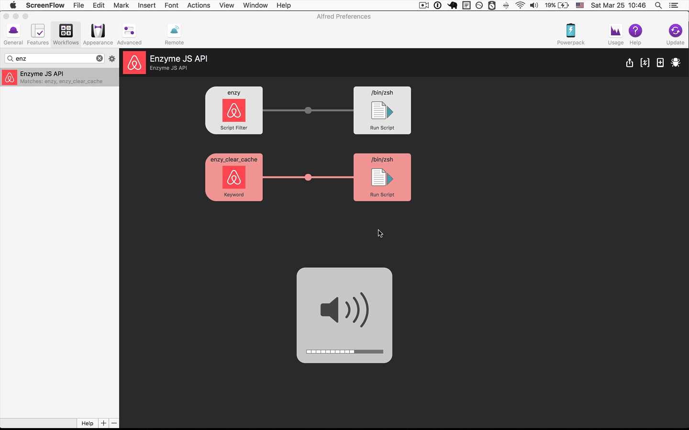

## Features

Search Enzyme JS API in [https://github.com/airbnb/enzyme/tree/master/docs/api](https://github.com/airbnb/enzyme/tree/master/docs/api).

## Installation

[import-workflow-source-to-alfred.md](https://github.com/tung-dang/alfred-workflow-nodejs-next/blob/master/docs/import-workflow-source-to-alfred.md)

## Usage

### Commands

- `enzy`: Search Yarn API from [https://github.com/airbnb/enzyme/tree/master/docs/api](https://github.com/airbnb/enzyme/tree/master/docs/api).
    + Enter to open a selected API in `http://airbnb.io/enzyme/docs/api/` website
    + CMD + Enter to open an selected API in GitHub page `https://github.com/airbnb/enzyme/tree/master/docs/api`
- `enzy_clear_cache`: clear all local cache. Search result is saved in local cache for 1 week - if cache is timeout (1 week), it will fetch from Github and store results in cache again.

## Development

- `yarn run export-wf`: zip entire project and export to `exported-workflow-file/YarnApiSearch.alfredworklow` file
- `yarn run export-push`: export --> commit --> push to Github